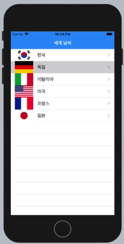

셀을 선택해서 두 번째 뷰로 이동했다가 다시 첫 번째 뷰로 돌아와도 셀의 포커스가 남아있다. 처음에는 아래의 글을 참고하여 인터페이스 빌더의 Selection 옵션을 None으로 바꾸어줬었는데, 이러면 이동 후에 돌아와도 포커스가 남아있지 않지만, 문제는 터치할 때도 색상이 변하지 않는다는 거다. 이건 UX 측면에서 적합하지 못하다고 판단해서, 다른 방법을 찾아봤다.

애플 개발자 공식 문서에서 해결책을 찾았다.

> If you respond to the cell selection by pushing a new view controller onto the navigation stack, deselect the cell when the view controller pops off the stack. If you’re using a UITableViewController to display a table view, you get the behavior by setting the clearsSelectionOnViewWillAppear property to true. Otherwise, you can clear the selection in your view controller’s viewWillAppear(\_:) method:

셀을 선택해서 새 뷰 컨트롤러를 네비게이션 스택에 push 하고 나서 다시 pop 할 때(= 원래 뷰로 돌아올 때) select 되어 있는 셀을 취소해야 한다. 취소하는 건 `viewWillAppear()`에서 처리하면 된다고 한다. 갔다가 다시 돌아오는 거니까 메모리엔 이미 뷰가 올라와있어서 `viewDidLoad()`에서 처리하는 건 적합하지 않다. 화면을 그리기 직전에 처리하는 게 적합하다.

```swift
override func viewWillAppear(_ animated: Bool) {
    super.viewWillAppear(animated)
    if let selectedIndexPath = tableView.indexPathForSelectedRow {
        tableView.deselectRow(at: selectedIndexPath, animated: animated)
    }
}
```

---

## 참고 자료

- [iOS: 테이블뷰 셀 터치 시 포커스 남기지 않기 (TableViewCell SelectionStyle)](https://ohgyun.com/641)