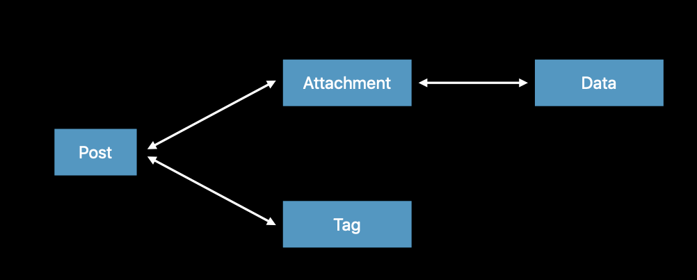
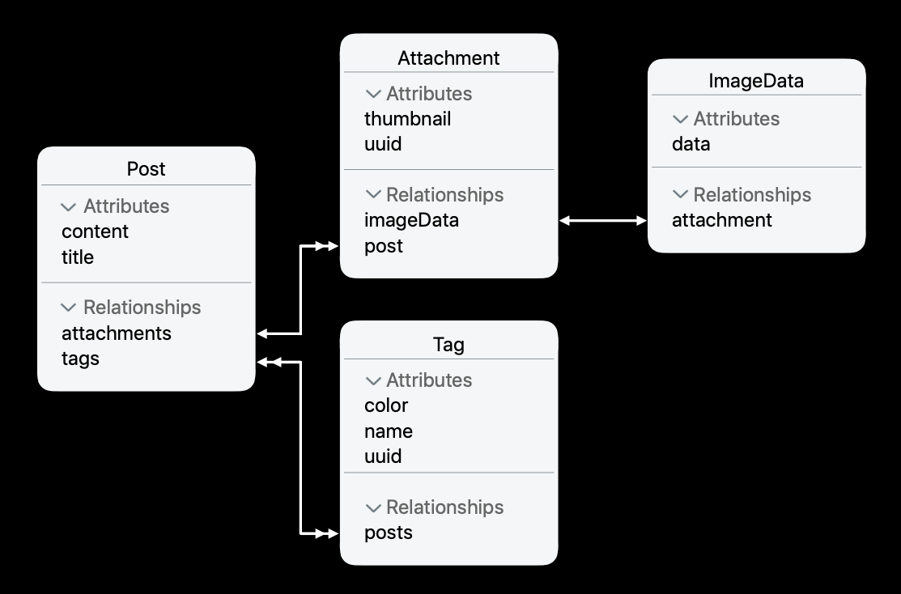
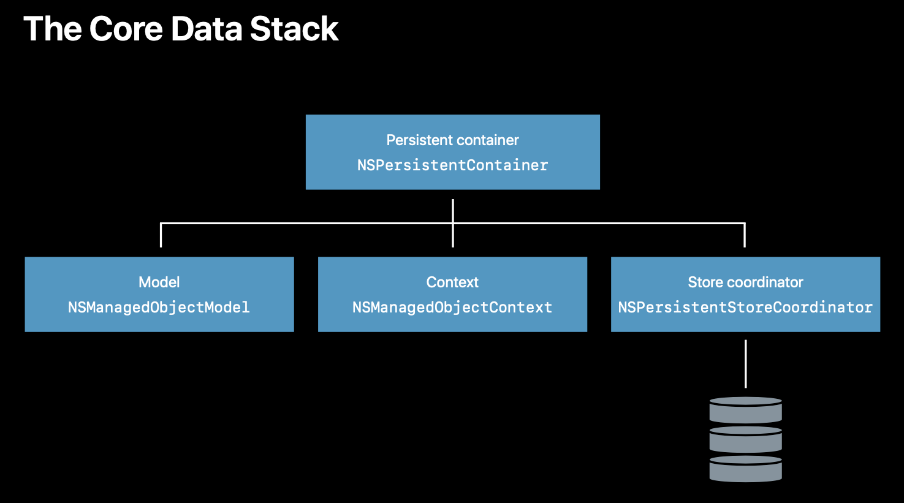
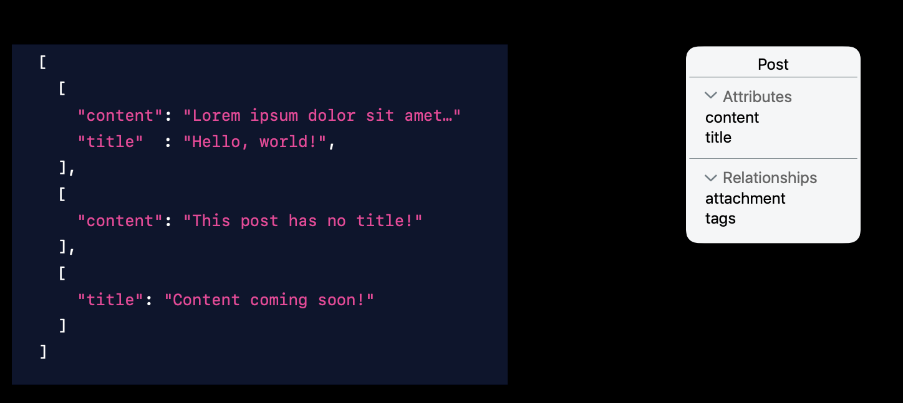
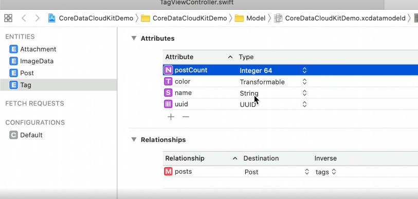
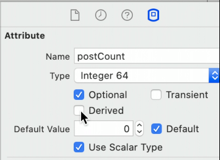
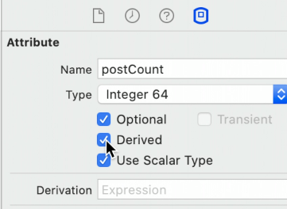
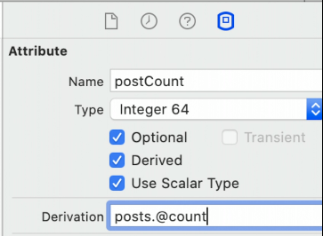

> [WWDC2019: Making Apps with Core Data](https://developer.apple.com/videos/play/wwdc2019/230/)를 시청하고 정리한 글입니다. 개인 견해가 ~~아주 많이~~ 들어있습니다.

## 요약

- Best Practice를 중점으로 Core Data 빠른 복습
- Core Data를 시작하고 실행하는 방법
- 앱 컨트롤러를 설정하는 방법
- ~~여러 코디네이터를 사용하는 방법 + 확장~~ → 이해 못해서 생략함
- 몇 가지 유용한 테스트 팁

## Modeling Data

| 목록 화면 | 작성 화면 |
| --- | --- |
|  |  |


예제로 다루는 앱은 일반적인 블로깅 앱과 유사하다. 태그를 여러 개 작성할 수 있고, 미디어도 여러 개 첨부할 수 있다. 이제 데이터 구조에 대해 생각해보자.



가장 먼저 떠오르는 데이터는 게시물(`Post`)이다. 미디어도 여러 개 첨부할 수 있다고 했으니, 이것도 타입이 될 수 있고, 태그 역시 별도의 타입이 될 수 있다.
그리고 여기서 미디어의 크기가 엄청 클 수 있으니까 별도로 저장한다. 왜냐하면 목록에서 썸네일만 표시하면 되니까 더 큰 데이터는 따로 보관한다는 거다.

> 썸네일과 원본 이미지 데이터를 별도의 엔티티로 분리하는 게 정말 효율적인지(메모리 소모 측면에서) 확인해볼 필요가 있는데, 이건 나중에 해보고 추가하거나 별도의 글로 작성할 예정

이렇게 구조를 생각했으니 이제 Xcode 열어서 Core Data 모델을 만들자.



모델 구조는 위와 같다. 데이터 간의 관계를 살펴보자. 먼저, `Attachment`와 `ImageData`는 `1:1` 관계다. 왜냐하면 `Attachment`는 썸네일(크기가 작은 이미지)이고, `ImageData`는 그에 대응하는 원본 이미지이기 때문이다. 

그렇기 때문에 `Attachment`가 삭제되면 `ImageData`도 같이 삭제되어야 한다. `Attachment`→`ImageData`의 Delete Rule은 `Cascade`이다.

> 반대의 경우엔 `Deny`가 적절할 거 같다. `Attachment`가 부모 엔티티라서 `ImageData`를 바로 삭제 못하게끔?

그 다음으로 `Post`와 `Attachment`의 관계는 `1:N` 이다. 아까 위에서 데이터 구조를 얘기할 때 게시물에 미디어를 여러 개 첨부할 수 있다고 했었기 때문이다. 게시물 하나에는 여러 개의 미디어를 첨부할 수 있지만, 미디어는 게시물 하나에만 종속되니까 `1:N` 이다.

`Post`와 `Tag` 관계는, "게시물은 여러 개의 태그가 있다."와 "태그는 여러 개의 포스트가 있다."를 생각하면 `N:M` 관계라는 걸 알 수 있다.

이렇게 Managed Object Model을 정의하긴 했는데, 모델을 사용하려면 알아둬야 하는 점이 있다.

## The Core Data Stack

```
한 줄 요약:
Core Data Stack은 Model, Context, Store coordinator로 구성되어 있고, 우리(Apple)가 너희 쓰기 편하라고 Persistent container라고 추상화해놓은 거 줄 거야 ㅋ
```



> The model is required by a PersistentStoreCoordinator, which as the name implies, is responsible for managing our persistent stores.  
Most of the time, this is a database that lives on the file system, though it's possible to have many stores at once, including our own custom made types that derive from NSPersistentStore. Finally, the type that we'll spend the most time with is the ManagedObjectContext.

모델은 Core Data 관리를 담당하는 `PersistentStoreCoordinator`가 필요하다. 대부분 Store Coordinator가 파일 시스템에 있는 데이버테이스인데, `NSPersistentStore`에 파생된 커스텀 타입을 포함해서 한 번에 많은 저장소를 가질 수 있다고 한다.

그 다음으로 알아둬야 하는 건 Managed Object Context인데, 우리가 가장 많이 쓰는 객체다.

Core Data는 Command pattern을 사용한다. 명령을 수행하려면 Context가 필요하다. fetch request할 때도 Context가 필요하다. 그리고 Context는 작업을 수행하려면 Coordinator를 알고 있어야 하고 Coordinator는 Persistent Store를 알기 위해서 모델을 알아야 한다.

Model - Context - Store Coordinator 가 서로 상호 의존적인 관계라는 뜻이다. 그리고 Apple은 Persistent Container라는 세 개를 통틀어서 캡슐화해놓은 타입 제공한다. Persistent Container를 쓰면 스택 변경하는 게 쉬워진다. 이름만 참조하면 알아서 해준다.

## Configuring Managed Object Contexts

모델을 코드로 생성하거나 여러 컨테이너와 함께 동일한 모델을 사용해야 하는 경우 이걸 제어할 수 있는 이니셜라이저가 있다.

> Once we have a container, we tell it to load our persistent stores. The completion block gets called once per store with a nil error parameter on success, after which is time to shift our focus to managed object contexts. Contexts provide us with seamless access to managed data, and they have a few options that can make them even more useful to certain use cases, such as driving our views.

Container가 있으면 Persistent Store를 불러오도록 지시한다. Completion Block은 성공하면 nil error parameter를 사용하여 Store당 한 번 호출되고, 그 후에는 Managed Object Context로 초점이 이동된다. Context는 Managed Data에 대한 원활한 접근 방식을 제공하고, 특정 사용 사례에 유용한 몇 가지 옵션이 있다.

### 쿼리 생성 지원

```swift
try container.viewContext.setQueryGenerationFrom(.current)
```

Store Data의 안정적인 뷰를 제공하여 다른 행위자가 변경하거나 삭제한 경우에도 객체에 안전하고 일관된 액세스를 허용한다.

### 변경 사항을 최신 상태로 유지

```swift
context.automaticallyMergesChangesFromParent = true
```

형제(?)가 변경 사항을 저장할 때 Context를 최신 상태로 유지하도록 구성한다.

## ⭐️ 중요한 점

Context를 사용할 때 기억해야 할 가장 중요한 점은 <mark><b>모든 저장소 요청 및 Managed Object와의 상호 작용이 Context 대기열 안에서 수행되어야 한다</b></mark>는 것이다.

```swift
context.performAndWait {
    /* Something */
}

context.perform {
    /* Something */
}

container.performBackgroundTask { context in
    /* Something */
}
```

backgroundContext에는 각각에 고유한 대기열(Queue)이 있다. 그래서 이걸 사용하려면 API가 필요한데, 위와 같이 버전이 여러 개가 있다.

`context.performAndWait()`은 블럭을 동기적으로 수행한다. `context.perform()`은 블럭을 비동기적으로 수행한다. 진정한 비동기 작업의 경우 Container는 Background Context를 생성하고 블록이 반환될 때 자동으로 폐기하는 백그라운드 작업 수행을 위한 편리한 방법이 있고, 이게 바로 `performBackgroundTask()` 이다.

## Apps Need Data

앱의 데이터를 추가해보자.
```swift
context.perform {
    let post = Post(context: context)
    post.title = "Hello, world!"
    try? context.save()
}
```

위 코드는 하나씩 데이터를 추가하는 코드이다. 만약 수백, 수천 개를 저장해야 한다면 어떻게 해야할까? 위에 처럼 하면 리소스 오버헤드는 물론이고 코드도 엄청 많이 작성해야 한다.

## Apps need _more_ data!

### Batch Insertions

```swift
let rawPostsData: Data = // Server response ...
if let postDicts = try? JSONSerialization.jsonObject(with: rawPostsData) as? [[String: Any]] {
	context.perform {
		let insertRequest = NSBatchInsertRequest(entity: Post.entity(), objects: postDicts)
		let insertResult = try? context.execute(insertRequest) as! NSBatchInsertRequest
		let success = insertResult.result as! Bool
	}
}
```

`rawPostsData`에 1000개의 객체가 담겨있다고 가정하고 보자.

먼저, `[[String: Any]]` 타입으로 형변환한다. 여기서 Key는 모델의 속성 이름과 일치해야 한다. Unique Constraint와 같은 게 필요하지 않으면 일부 생략 가능하다.



이 경우에는 세 개의 Dictionary가 들어간다.

모델에서 기본 값을 구성한 경우에 Core Data에서 이를 사용한다.

```swift
let insertRequest = NSBatchInsertRequest(entity: Post.entity(), objects: postDicts)
let insertResult = try? context.execute(insertRequest) as! NSBatchInsertRequest
```

이 부분에서 아까 얻은 Dictionary 배열 객체를 모델 객체 엔티티를 사용해서 일괄 삽입 요청하는 인스턴스를 만든다. 그리고 `execute()`를 하는데 `NSBatchInsertRequest` 타입으로 결과물이 나온다.

여기서 알아둬야 하는 점
- 기존 객체에 Unique Constraint가 있는 경우 → 외부에서 가져온 데이터베이스에서 제거되고 대신 새 값으로 업데이트된다.
- Batch Insert를 할 때 관계 설정은 못한다. 그런데 Batch Insert가 Unique Constraint로 인해 기존 객체를 업데이트하는 경우에는 기존 관계는 그대로 유지된다.
- `contextDidSaveNotification`을 생성하지 않는다. 직접 관리 해야 한다.

```
이 부분 보면서 당황했던 점: 관계 설정 못하는 거 자랑 아닌데; 그럼 다른 해결책이라도 제공해줘야 하는 거 아니야???
```

## The needs of the Controller

### 데이터를 가져와 표시하기 (fetch data)

```swift
let fetchRequest: NSFetchRequest<Tag> = Tag.fetchRequest() // 1

fetchRequest.predicate = NSPredicate(format: "name = %@", tagName) // 2

if let tag = try? fetchREquest.execute().first {  // 3
	tagLabel.text = tag.name  // 4
	tagLabel.textColor = tag.color as? UIColor // 4
}
```

1. Managed Object 클래스에 `fetchRequest()`라는 메서드가 있다. 미리 구성된 fetch request를 제공한다.
2. predicate를 통해 필터링해서 데이터를 추출한다. 이 경우엔 name 속성을 가지고 필터링한다.
3. requeset를 실행한다. 여기선 요청한 거에서 첫번째만 추출한다.
4. 뽑은 데이터로 뷰를 구성한다.

여기까지는 변경할 수 없는 데이터에 적합하다. 만약 뷰가 실행되는 동안 태그의 이름이나 색상이 변경되면? 객체 속성이 업데이트 되게 하면 된다. 어떻게? KVO랑 Combine 쓰면 된다.

```swift
let fetchRequest: NSFetchRequest<Tag> = Tag.fetchRequest()

fetchRequest.predicate = NSPredicate(format: "name = %@", tagName)

if let tag = try? fetchREquest.execute().first {
	nameSubscription = tag.publisher(for: \.name)
                            .assign(to: \.text, on: tagLabel)
	colorSubscription = tag.publisher(for: \.color)
                            .map({ $0 as? UIColor })
                            .assign(to: \.textColor, on: tagLabel)
}
```
여기선 Combine이 쓰였는데 아마 RxSwift 혹은 Notification Center로 비슷하게 구현할 수 있을 거 같다. (그리고 나는 프로젝트에서 RxSwift 쓰니까 못해도 해야 함ㅎ)

Detail View를 위한 구성도 해보자.

```swift
if let tag = tag {
	nameSubscription = tag.publisher(for: \.name)
                            .assign(to: \.text, on: tagLabel)
	
	colorSubscription = tag.publisher(for: \.color)
                            .map({ $0 as? UIColor })
                            .assign(to: \.textColor, on: tagLabel)
}
```

일반적으로 Detail View의 부모는 CollectionView 또는 TableView이다. 그리고 fetch request에서 객체를 가져온다. 

많은 객체를 가져올 때 중요하지만 아직 이야기하지 않은 부분이 있다. requestSortDescriptors와 Batched fetching.

#### requestSortDescriptors

```swift
fetchRequest.sortDescriptors = [NSSortDescriptor(key: "name", ascending: true)]
```

fetch request의 결과를 정렬하는 기준을 정의한다.

#### Batched fetching

```swift
fetchRequest.fetchBatchSize = 50
```

가져오려는 객체가 1400만개라고 가정해보자. 우리는 이걸 한꺼번에 가져올 필요가 없다. 화면에서 1400만개를 다 보여줄 수 없기 때문이다. 그래서 뭐가 있냐면 batch size라는 게 있다. 한 번에 가져오려는 개수를 구성하는 프로퍼티다. 위 코드는 1400만개를 한꺼번에 가져오지 말고 50개씩 끊어서 가져온다는 뜻이다. 앱의 응답성에 큰 차이를 만든다.

방금 공부한 거로 모든 태그 가져오는 거? 짱 쉽다. 그런데 Detail View에 표시하는 객체의 속성이 변경되면 어떻게 해야할까? 당연히 변경점에 따라서 반영해줘야 한다. 어떻게 할 거냐면...

Core Data는 fetch results controller 형태의 라이브 쿼리를 지원한다.

```
본인들 말로는 `운 좋게도` 라는 표현을 쓴다. 당황쓰
```

```swift
let fetchRequest: NSFetchRequest<Post> = Post.fetchRequest()

fetchRequest.sortDescriptors = [NSSortDescriptor(key: "title", ascending: true)]
fetchRequest.fetchBatchSize = 50
```

title을 기준으로 정렬해서 한 번에 50개의 `Post`를 가져오는 코드다. 여기에 result controller와 결합해보자.

```swift
let fetchRequest: NSFetchRequest<Post> = Post.fetchRequest()

fetchRequest.sortDescriptors = [NSSortDescriptor(key: "title", ascending: true)]
fetchRequest.fetchBatchSize = 50

let controller = NSFetchedResultsController(fetchRequest: fetchRequest,
											managedObjectContext: moc,
											sectionNameKeyPath: nil, cacheName: nil)
controller.delegate = self

try! controller.performFetch()
```

fetchRequest를 Fetched Results Controller한테 위임한다. 그러면 Result Controller가 변경사항을 알아서 가져오고 어쩌구 저쩌구 다 한다는 뜻이다. 그리고 delegate를 지정해줬는데, 여기에 메서드 몇 개를 지원한다.

- `controllerWillChangeContent(:)` → 변경사항이 언제 들어오기 시작하는 지 알려준다.
- `controller(:didChange:atSectionIndex:for:)` → 섹션이 변경된 시점을 알려준다.
- `controller(:didChange:at:for:newIndexPath:)` → 변경된 각 객체에 대해 어떻게 변경되었는 지 알려준다.
- `controllerDidChangeContent(:)` → 변경사항 끝났다고 알려준다.

이런 메서드들은 보통 TableView API랑 관련있게 설계되어 있다. 그런데 TableView를 다시 그릴 때 쿼리 결과랑 일치하게 작성하려면 코드가 더러워진다. 그리고 Collection View는 이런 변경 콜백 패턴을 지원하지 않는다.

그래서 우리(Apple)가 Fetch Results Controller에서 또 새로운 거 지원한다ㅋ  
→ `NSDiffableDataSourceSnapshot`

간단하게 설명하면, 스냅샷을 찰칵찰칵해서 이전 스냅샷이랑 비교하고 변경된 사항을 적용시키는 방식이다.

`DiffableDataSourceSnapshot` 말고도 `CollectionDifference` 라는 새로운 타입도 있다. 이건 두 컬렉션 간의 차이를 인코딩하고 두 컬렉션에서 생성될 수 있다고 한다.   
→ 자세한 건 세션 711을 보라고 하는데, 세션 711이 없다. OTL... 그런데 킹갓제드님이 설명해놓은 글이 있는데 이거 꼭 보세요 설명 짱쉬움 [Swift 5.1 ) Ordered Collection Diffing](https://zeddios.tistory.com/774)

각설하고,

우리의 목적은 1차원 타입이다. 그래서 섹션 가져오기를 사용하지 않을 때만 지원한다. 그리고 SnapshotDelegate 방법과 마찬가지로 legacy한 change reporting 방법이랑 상호 배타적이다. 따라서 Fatched Results Controller에서 여러가지를 동작하게 하려면 여러 Fatched Results Controller를 사용해야 한다.

Collection View의 단일 섹션을 보여주는 방법을 보자.

```swift
func controller(
    _ controller: NSFetchedResultsController<NSFetchRequestResult>, 
    didChangeContentWith diff: CollectionDifference<NSManagedObjectID>
) {
    collectionView.performBatchUpdates({
        for change in diff {
            switch change {
                case .insert(offset: let newRow, element: _, associatedWith: let assoc):
                    if let oldRow = assoc { // 1
                        collectionView.moveItem(
                            at: IndexPath(row: oldRow, section: frcSection),
                            to: IndexPath(row: newRow, section: frcSection))
                    } else { // 2
                        collectionView.insertItems(
                            at: [IndexPath(row: newRow, section: frcSection)])
                    }
                case .remove(offset: let oldRow, element: _, associatedWith: let assoc):
                    if assoc == nil { // 3
                        collectionView.deleteItems(
                            at: [IndexPath(row: oldRow, section: frcSection)])
                    }
            }
        }
    }, completion: nil)
}
```

`CollectionDifference`는 두 가지 변경 사항을 지원하는데 삽입이랑 삭제다. 서로 반대되는 두 변경사항은 연관을 통해 서로 참조할 수 있다. 

1. 객체가 이동했거나 최소한 변경되었음을 의미한다.
2. 이전 결과에 없었던 내용이니까 삽입한다. Collection View에 추가하라고 지시한다.
3. 관계성(`assoc`)이 없으면 삭제하라는 뜻이다.

이제 Fetched Results 를 뷰에 쉽게 적용할 수 있다. 그런데 결과 자체를 가져오기 어렵다면 어떻게 될까? fetch를 위한 fetch request을 작성할 수 없으면? fetch request를 실행할 때 성능 문제가 발생하면? 특정 시점에서 컨트롤러의 요구 사항이 모델의 요구사항보다 더 중요하다. 그래서 모델링의 순수성을 일부 포기해야 한다. 그리고 그게 바로 역정규화.

```
난 역정규화가 정말실타
```

## Denormalization

WWDC 2018 세션 224에서 역정규화에 대한 얘기를 했었는데, 요약하면 역정규화는 데이터 복사본을 복사해놓는 거라 접근할 때 더 효율적일 수 있다는 내용이다.

물론 추가 데이터를 유지 관리하는 건 또 추가적인 오버헤드 대가가 따른다. 그렇지만? 데이터베이스 인덱스를 생각해보자. 인덱싱된 모든 열의 복사본을 유지하는 대가로 해당 열에 접근할 때 번개처럼 빠르다.

우리 앱을 다시 살펴보자. 역정규화를 하면 각 태그를 사용하는 게시물 수를 추적할 때 좋다. 태그에 `postCount`라는 정수 속성만 추가하면 된다. 그리고 게시물에 태그가 지정될 때 증가, 태그가 제거될 때 감소시키는 로직을 추가하는 것 뿐이다. 이렇게 하면 버그가 없고 일관성이 있을 거 같지만... 이렇게 하지 말고 파생 속성을 써라.

### Derived Attributes

Core Data에서 유지 관리하는 정규화된 메타 데이터이다.

이건 Managed Object Model에 정의된다. 그리고 Xcode에서 편집할 수도 있다. 아니면 `NSDerivedAttributeDescription`를 이용해서 코드에서 정의할 수도 있다.

엔티티의 모든 속성을 One Level Deep하게 참조할 수 있다. 비정규화도 쉽게 만든다.

### *Demo*

```swift
override func tableView(_ tableView: UITableView, cellForRowAt indexPath: IndexPath) -> UITableViewCell {
	guard let cell = tableView.dequeueReusableCell(withIdentifier: "TagCell", for: indexPath) as? TagCell else {
		fatalError("###\(#function): Failed to dequeue TagCell. Check the cell reusable identifier in Main.storyboard.")
	}

	let tag = dataProvider.fetchedResultsController.object(at: indexPath)
	cell.nameLabel.text = "\(tag.name!) (\(tag.posts?.count ?? 0))"
	cell.nameLabel.textColor = tag.color as? UIColor

	return cell
}
```

블로깅 앱이 있다. 태그 관리자를 보면 세 개의 태그와 많은 게시물이 있다는 걸 알 수 있다. 그런데 여기에서 동작하는 뷰 쪽 코드는 실제로 관계 게시물을 순회하고 카운트를 가져온다. (`tag.posts?.count ?? 0` 부분) 더 많은 데이터가 있으면 당연히 성능 문제가 생긴다. 그래서 Derived Attributes를 사용하는 방식으로 수정해볼 예정이다.



새로운 속성을 추가한다. `postCount: Integer 64`

그리고서 Attribute Inspector 를 보면 Derived 라는 항목이 있다.



해당 항목을 체크하면 새로운 항목이 생긴다.




Derivation 항목에 표현식을 적으면 된다. 우리는 post의 개수를 알고싶으니까 `posts.@count`로 적으면 된다. 이제 빌드하면 `postCount`라는 변수로 접근해서 쓸 수 있다. 훨씬 빠르고 더 좋다. so goooood!

지원되는 표현식은 개발자 문서를 참고.

→ [NSDerivedAttributeDescription - Apple Developer Documentation](https://developer.apple.com/documentation/coredata/nsderivedattributedescription)

일반적으로 사용하는 건 네 개의 클래스이다.

- Data duplication  
    Attachment Identifier와 이걸 뒷받침하는 Image Data의 복사본을 유지하는 것과 같이 완전한 복제
- Data transformation  
    태그 이름을 소문자로 처리하거나 일부 유니코드 문자열을 정규화하는 거 같은 필드 변환
- To-many aggregate functions  
    Like 집계 함수
- Zero-parameter functions  
    매개변수 쓰지 않는 `now()` 같은 전역 함수 → 객체가 마지막으로 업데이트된 시간을 추적할 때 같은 작업에 유용

## Scaling your app

조금 더 고오오급 주제와 Scaling에 대해서 이야기하는 부분이다. 일부분만 이해했고, 정리를 하긴 했는데 완전히 이해한 건 아니라서 생략.

그래도 간단하게 요약하면 변경 사항의 일부분만 조회하거나, 특정 시간 범위 내의 기록만 조회하고 싶을 때 Persistent History 라는 걸 쓰라는 내용이다.

## Testing

1. Test against actual performance goals  
    성과 목표가 무엇인지 아는 것  
    데이터 셋에 따라 테스트를 해야 한다. 예를 들어 연락처 앱은 수 만개의 객체로 테스트 해야 하고, 이미지 앱은 수백만개로 테스트 해야 한다.
2. Run intergration tests in multiple configs  
    여러 종류의 문제도 감지하고 테스트할 수 있게 구성해야 한다. 그래서 프레임워크에서 제공하는 동시성 디버깅도 활용해야 한다.
3. Use in-memory stores where appropriate  
    여러 구성에서 통합 테스트하면 시간이 많이 소요된다. 단위 테스트는 최대한 빨라야 하기 때문에 테스트 런타임이 중요한 경우에 in-memory 를 사용해라.  
    → 구체적으로 SqLightStores in-memory를 의미
    ```swift
    let container = NSPersistentCloudKitContainer(name: "CoreDataCloudKitDemo")

    let description = container.persistentStoreDescriptions.first!

    description.url = URL(fileURLWithPath: "/dev/null") // .appendingPathComponent(str)

    container.loadPersistentStores(completionHandler: { (_, error) in
        guard let error = error as NSError? else { return }
        fatalError("###\(#function): Failed to load persistent stores:\(error)")
    })
    ```

    위와 같은 방식으로 하라는 내용. 이렇게 하면 매우 좋은 성능의 Core Data Stack이 만들어진다. 근데 in-memory 저장소는 코디네이터간에 공유가 안된다. 대신 명명된 메모리 내 저장소를 활용하라는 내용이 있는데 주석 처리해놓은 부분을 추가해서 쓰라는 말이다.

    그리고 마지막으로 Sanitizers를 사용해라. 이건 Xcode에서 제공하는 기능인데 자세한 건 Diagnosing Memory, Thread, and Crash Issues Early 문서 참고


## 참고 자료

- [Diagnosing Memory, Thread, and Crash Issues Early](https://developer.apple.com/documentation/xcode/diagnosing-memory-thread-and-crash-issues-early)