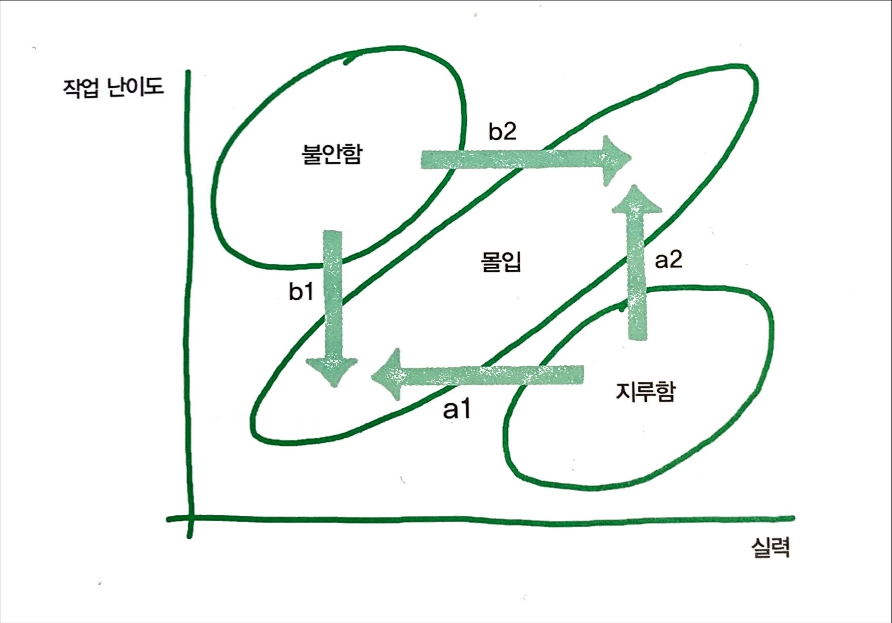

> 김창준님의 [함께 자라기](https://book.naver.com/bookdb/book_detail.nhn?bid=14341885)를 읽고 정리한 글입니다. 

- 현실에서는 충돌하는 것이 정상적이다. 모든 화살표가 같은 곳을 가리키는 경우가 더 예외적이다. 그래서 상반된 의견과 정보 속에서 스스로 생각하는 훈련을 해나가야 한다.
- 야생 학습* (학교 학습과 반대되는 개념)
  - 야생 학습은 대부분 협력적이다(학교 학습은 대부분 개별적이다).
  - 야생 학습은 대부분 비순차적이다(학교 학습은 공부 순서가 정해져 있다).
  - 야생 학습은 대부분 자료에 한정이 없다(학교 학습은 대부분 교과서, 교재, 시험 범위 등이 정해져 있다).
  - 야생 학습은 대부분 명확한 평가가 없다(학교 학습은 대부분 시험이라는 명확한 평가기준이 있다).
  - 야생 학습은 대부분 정답이 없다(학교 학습은 무엇이 정답이라고 하는 것이 명확하다).
  - 야생 학습은 대부분 목표가 불문명하고 바뀌기도 한다(학교 학습은 대부분 합격, 자격증 같은 목표가 분명하다).
- 자기가 습득한 지식이나 능력은 복리로 이자가 붙는다.
  - 따라서 더 빨리 자라나고 싶다면 아래의 항목을 고민해야 한다.
    - 어떻게 이율을 높일 것인가
    - 지속적으로 현명한 투자를 하려면 어떻게 할 것인가
  - A, B, C 작업
    - A 작업은 원래 그 조직이 하기로 되어 있는 일
      - 어떻게 하면 더하기보다 곱하기를 할 수 있을 것인가
      - 어떻게 해야 곱하는 비율(이자율)을 높일 수 있는가 혹은 이자 적용 주기를 짧게 할 수 있는가
    - B 작업은 A 작업을 개선하는 일
    - C 작업은 B 작업을 개선하는 일
  - 저자의 몇 가지 힌트
    - 자신이 이미 갖고 있는 것들을 잘 활용하라.
      - 내가 지식을 얼마나 어떻게 활용하는지 반성하라.
      - 이미 갖고 있는 것들을 하이퍼링크로 서로 촘촘히 연결하라.
      - 새로운 것이 들어오면 이미 갖고 있는 것들과 충돌을 시도하라.
      - 현재 내가 하는 일이 차후에 밑거름이 될 수 있도록 하라.
    - 외부 물질을 체화하라.
      - 계속 내부 순환만 하다가는 일정 수준에 수렴할 위험이 있다. 주기적인 외부 자극을 받으면 좋다. 단, 외부 자극을 받으면 그걸 재빨리 자기화해야 한다.
      - 외부 물질 유입 이후 생긴 내부의 갈등을 해결하려는 데에 노력을 기울여야 한다. 무시하고 덮어두지 말라. 내가 가진 것들의 상생적 관계를 끌어내도록 하라.
    - 자신을 개선하는 프로세스에 대해 생각해보라.
      - 나의 A 작업을 되돌아보는 회고/반성 활동을 주기적으로 하는 프로세스를 만들어라(C 작업).
      - 나를 개선하는 과정(B 작업)을 어떻게 하면 개선할 수 있을지 고민하라.
    - 피드백을 자주 받아라.
      - 사이클 타임을 줄여라. 순환율을 높여라.
      - 일찍, 그리고 자주 실패하라. 실패에서 학습하라.
    - 자신의 능력을 높여주는 도구와 환경을 점진적으로 만들어라.
      - 완벽한 도구와 환경을 갖추는 데에 집착해선 안 된다.
- 꾸준한 반복으로 달인이 되려면
  - 실력을 개선하려는 동기가 있어야 한다.
  - 구체적인 피드백을 적절한 시기에 받아야 한다.
- 제자리걸음에서 벗어나기
    
    - 지루함을 느끼는 경우: a1 실력 낮추기
    - 지루함을 느끼는 경우: a2 난이도 높이기
    - 불안함을 느끼는 경우: b2 실력 높이기
    - 불안함을 느끼는 경우: b1 난이도 낮추기
    - 지속적으로 자신의 감정 상태를 살피면서 지금 지루한지 불안한지를 알아채고, 네 가지 전략을 적절히 사용해야 한다.
        - 자기가 지금 어떤 상태인지 살피는 '알아차림(mindfulness)'이 꼭 필요하다.
- 협력
  - 시각화 없이 협력하는 것(전화 통화나 텍스트로만 소통한다든지)보다 중간 매개(화이트보드, 종이 등)를 두고 협력하는 것이 훨씬 낫다.
  - 둘이서 협력하면서 작업하면 서로 시각이 다르기 때문에 두 사람의 다른 시각을 연결해 줄 다리가 필요하고, 그 다리에는 필연적으로 추상화의 요소가 있게 된다. 서로 다른 것들을 하나로 묶어야 하기 때문이다. 반면 혼자서 작업할 경우에는 이런 추상화의 필요가 덜하다.
  - 자신이 작성하는 코드의 추상성을 높이고 싶다면 혼자서 고민하지 말고 다른 사람들과 협동하고, 대화하라. 같이 그림도 그려보고 함께 소스코드를 편집하라. 인간에게는 다른 인간과 소통하고 협력할 수 있는 놀라운 능력이 있다. 대화는 기적이다.
- 신뢰를 깎는 공유, 신뢰를 쌓는 공유
  - 복수 공유: 각자 여러 개의 디자인을 만들고 그걸 모두 공유한 경우
  - 복수 공유는 (같은 시간을 투자했을 때) 신뢰도 높아지고 성과도 더 좋았다.
- 품질은 상대적이다.
  - 객관적의 개념 자체가 매우 주관적이다.
  - 결국 결정하는 것은 사람이다.
  - 의사결정을 하는 과정에서 감정적이고 직관적인 부분이 큰 역할을 하고 있으며, 그런 감정적 부분이 배제된다면 의사결정을 제대로 할 수 없다.
  - 남을 설득하려면 논리성과 객관성에 대한 환상을 버려야 한다. 내가 설득하고 싶은 상대를 자주 만나서 신뢰를 쌓고, 그 사람이 무엇을 중요하게 여기는지, 어떤 설명 방식을 선호하는지 이해해야 한다.
- 쾌속 학습팀
  - 팀원을 뽑을 때부터, 선발 자체가 매우 협동적으로 이루어진다(비유하자면 디자이너를 뽑는 데 개발자가 관여한다든지). 단순한 업무 수행 능력뿐만 아니라 다른 사람과 협력을 얼마나 잘하는지, 새롭고 애매모호한 상황을 즐길 수 있는지, 자기보다 지위가 높은 사람에게도 자신 있게 의견을 제안할 수 있는지 등.
  - 속도가 빠른 팀은 개개인이 새로운 기술을 획득해야 한다고 보지 않고, 함께 일하는 새로운 방법을 만들어야 한다고 생각한다.
  - 심리적으로 보호가 된다. 뭔가 새로운 것을 제안하고 시도하는 데에 열려 있었고 실패에 관대했으며 잠재적 문제를 지적하고 실수를 인정하는 데에 부담을 느끼지 않았다.

애자일의 씨앗을 한 문장으로...

> 고객에게 매일 가치를 전하라.

- 고객에게
  - 우리의 진짜 고객은 누구인가?
- 매일
  - 어떻게 점진적으로 가치를 전할 것인가?
  - 어떻게 보다 일찍, 그리고 보다 자주 가치를 전할 것인가?
- 가치를
  - 무엇이 가치인가?
  - 지금 우리가 하고 있는 일이 정말 가치를 만드는 일인가?
  - 지금 가장 높은 가치는 무엇인가?
  - 비슷한 수준의 가치를 더 값싸게 전달하는 방법은?
- 전하라
  - 가치를 우리가 갖고 있지 않고 고객에게 정말 전달하고 있는가?
  - 고객이 정말 가치를 얻고 있는가?

---

읽으면서 느낀 점
  - 지난날의 잘못에 대해 매우 반성 중.
  - 상대방은 어떻게 느끼고 있는지 몰라도, 요즘 (스스로 생각하기에 비교적) 공유하려고 노력하는데 어렵다. 나도 생각 정리가 안 돼서 상대방은 내가 어떤 말을 하고 싶은 건지, 뭘 원하는지 파악 못 할 거 같다. 
  - 자신이 어떤 상태인지 지속해서 파악하는 게 중요하다. 제일 못하는 건데 성장하기 위해선 제일 중요한 부분. 이건 어떻게 파악해야 하지?
  - 스스로 변화하기 위해서 노력해야 한다.