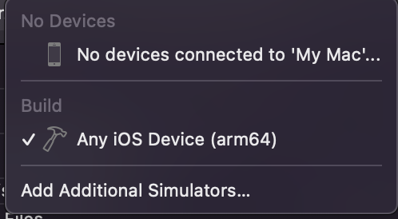
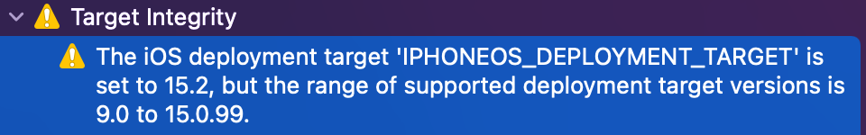
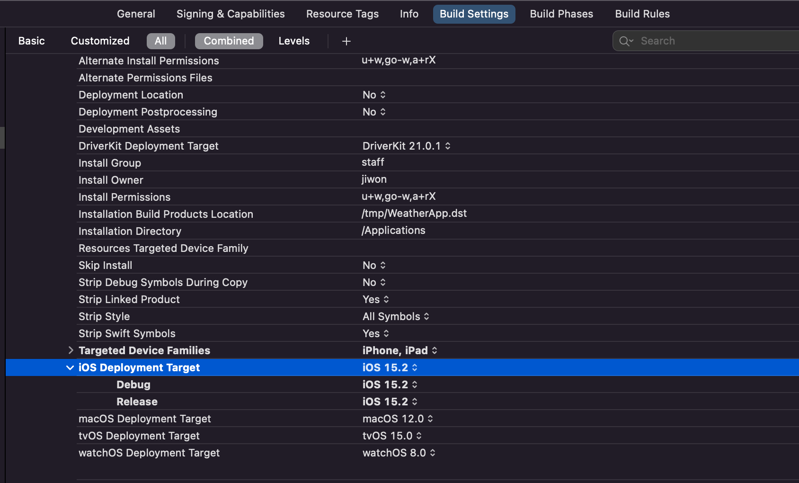

갑자기 시뮬레이터가 표시 되지 않았다. 아무것도 안해서 어리둥절

빌드할 때 보니까 사진과 같이 경고?가 발생하는데, 해당 경고를 누르면 문제가 되는 부분으로 이동한다.

현재는 15.2로 되어있는데, 이걸 15.0 으로 변경해주면 설치되어있는 시뮬레이터 목록이 뜬다.

아마도 Xcode에서 지원하는 버전과 시뮬레이터 버전이 다르면서 발생하는 문제인 거 같다.